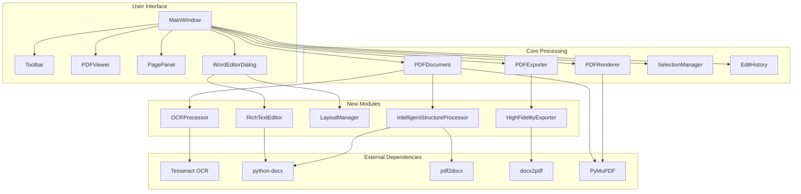
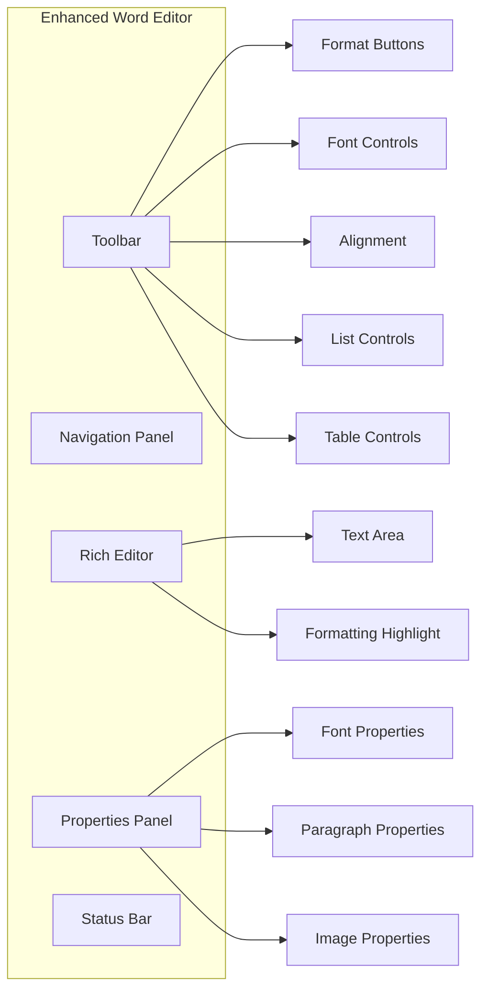
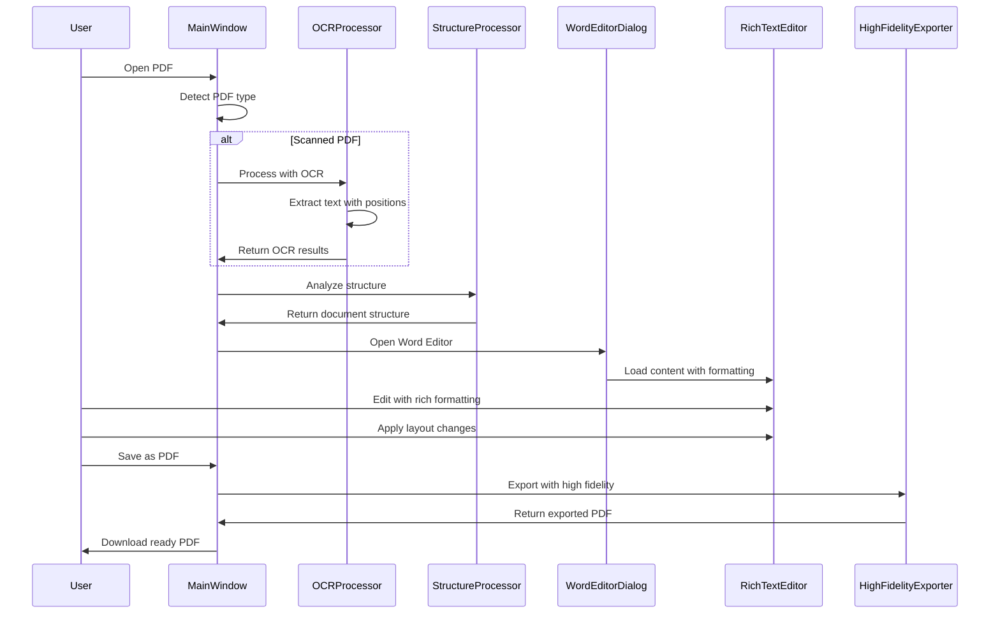

# Complete WYSIWYG PDF Editing System — Architecture Plan

## Executive Summary

This document outlines the architecture for transforming the existing PDF Editor into a comprehensive WYSIWYG-style document editing system that supports both native and scanned PDFs with OCR capabilities, rich text formatting, advanced layout management, and high-fidelity PDF export.

## System Overview

The enhanced system will provide:

1. **OCR Integration** - Automatic text extraction from scanned PDFs using Tesseract
2. **Rich Text Editor** - Full-featured WYSIWYG editor with formatting toolbar
3. **Layout Management** - Drag-and-drop positioning, text wrapping, multi-column support
4. **High-Fidelity Export** - Preserved formatting, fonts, colors, and layout structure
5. **Intelligent Processing** - Smart text extraction, structure preservation, format detection

## Architecture Diagram



## Technology Stack

| Component | Technology | Purpose |
|-----------|-------------|---------|
| GUI Framework | CustomTkinter | Modern UI widgets |
| PDF Engine | PyMuPDF (fitz) | PDF rendering, manipulation |
| OCR Engine | Tesseract/pytesseract | Text extraction from scanned PDFs |
| Word Processing | python-docx | Rich text editing, DOCX manipulation |
| PDF Conversion | pdf2docx, docx2pdf | Bidirectional PDF↔DOCX conversion |
| Image Processing | Pillow (PIL) | Image manipulation for OCR |
| Language | Python 3.11+ | Core application language |

## New Dependencies

```
pytesseract>=0.3.10
tesseract-ocr  # System package
openpyxl>=3.1.2  # For enhanced DOCX support
Pillow>=10.0.0
```

## Module Architecture

### 1. OCR Processor Module (`app/core/ocr_processor.py`)

```python
class OCRProcessor:
    """
    Handles OCR processing for scanned PDFs.
    
    Features:
    - Page-by-page OCR with progress tracking
    - Multi-language support
    - Confidence scoring and quality assessment
    - Text position preservation
    - Image preprocessing (deskew, denoise)
    """
    
    Methods:
    - process_page(page, language, dpi) -> OCRResult
    - process_document(doc, language) -> List[OCRResult]
    - preprocess_image(image) -> PIL.Image
    - detect_text_regions(page) -> List[Rect]
    - get_available_languages() -> List[str]
    - validate_tesseract_installation() -> bool
```

**Key Features:**
- Automatic detection of scanned vs native PDFs
- Configurable OCR quality/speed tradeoff
- Multi-language OCR (English, Portuguese, Spanish, etc.)
- Text position mapping for layout preservation
- Progress callbacks for large documents

### 2. Rich Text Editor Module (`app/core/rich_text_editor.py`)

```python
class RichTextEditor:
    """
    Manages rich text editing with full formatting capabilities.
    
    Features:
    - Character formatting (bold, italic, underline, strikethrough)
    - Font selection and sizing
    - Color management (text, background)
    - Paragraph formatting (alignment, spacing, indentation)
    - Lists (ordered, unordered, nested)
    - Tables (basic creation and editing)
    - Hyperlinks
    - Images
    """
    
    Methods:
    - apply_formatting(format_type, value)
    - get_current_formatting() -> FormattingState
    - insert_text(text, formatting)
    - insert_image(image_path, size, alignment)
    - create_table(rows, cols)
    - apply_paragraph_style(style)
    - export_to_docx() -> Document
    - import_from_docx(doc) -> None
```

**Formatting Features:**
- Bold, Italic, Underline, Strikethrough
- Font family and size (8-72pt)
- Text color and highlight color
- Alignment (left, center, right, justify)
- Line spacing and paragraph spacing
- Bulleted and numbered lists
- Basic table support
- Image insertion with sizing

### 3. Layout Manager Module (`app/core/layout_manager.py`)

```python
class LayoutManager:
    """
    Manages document layout and element positioning.
    
    Features:
    - Drag-and-drop element positioning
    - Text wrapping around images
    - Multi-column layout support
    - Grid-based alignment
    - Absolute positioning
    - Responsive layout calculations
    """
    
    Methods:
    - add_element(element, position, size)
    - move_element(element_id, new_position)
    - resize_element(element_id, new_size)
    - calculate_text_wrap(text, region) -> List[TextLine]
    - create_columns(count, spacing) -> Layout
    - align_elements(alignment_type)
    - export_layout() -> LayoutData
    - import_layout(layout_data) -> None
```

**Layout Features:**
- Visual drag-and-drop positioning
- Snap-to-grid alignment
- Text flow control
- Column breaks and page breaks
- Element layering (z-index)
- Responsive layout for different page sizes

### 4. High Fidelity Exporter Module (`app/core/high_fidelity_exporter.py`)

```python
class HighFidelityExporter:
    """
    Exports edited documents to PDF with maximum fidelity.
    
    Features:
    - Font embedding
    - Color space preservation
    - Vector graphics support
    - Image quality control
    - Metadata preservation
    - PDF/A compliance option
    """
    
    Methods:
    - export_with_fidelity(doc, output_path, options) -> ExportResult
    - embed_fonts(doc, font_paths) -> None
    - preserve_images(doc, quality) -> None
    - convert_vectors(doc) -> None
    - validate_pdf(pdf_path) -> ValidationResult
    - optimize_pdf(pdf_path, options) -> None
```

**Export Features:**
- Font subset embedding
- CMYK/RGB color space handling
- Image compression control
- Vector graphics preservation
- PDF metadata preservation
- PDF/A-1b compliance option

### 5. Intelligent Structure Processor Module (`app/core/intelligent_structure_processor.py`)

```python
class IntelligentStructureProcessor:
    """
    Intelligently processes and preserves document structure.
    
    Features:
    - Heading detection and hierarchy
    - Table detection and extraction
    - List detection and classification
    - Image caption detection
    - Page layout analysis
    - Document type classification
    """
    
    Methods:
    - analyze_structure(doc) -> DocumentStructure
    - detect_headings(text_blocks) -> List[Heading]
    - extract_tables(page) -> List[Table]
    - classify_lists(text_blocks) -> List[ListInfo]
    - preserve_structure(original, edited) -> Document
    - merge_structures(base, overlay) -> Document
```

**Structure Features:**
- Automatic heading hierarchy detection
- Table boundary detection
- List type classification (ordered, unordered)
- Document type recognition (article, report, form)
- Structure preservation during conversion

## Enhanced Word Editor Dialog

The existing [`WordEditorDialog`](app/ui/dialogs/word_editor_dialog.py) will be significantly enhanced:

### New UI Components



### Rich Text Formatting Toolbar

```
┌─────────────────────────────────────────────────────────────────────────────┐
│ 📄 Document    [Undo] [Redo] |  Save  Save as PDF  Close              │
├─────────────────────────────────────────────────────────────────────────────┤
│ [B] [I] [U] [S] |  Font: [Arial ▼]  Size: [12 ▼]               │
│ [A] [A] [A] [J] |  Color: [■]  Highlight: [■]  |  [•] [1.] [Table]  │
├─────────────────────────────────────────────────────────────────────────────┤
│                                                                     │
│  Navigation  │              Rich Text Editor Area                        │
│  Panel       │                                                        │
│              │  [Document content with live formatting preview]           │
│  Paragraphs  │                                                        │
│  Headings    │                                                        │
│  Tables      │                                                        │
│  Images      │                                                        │
│              │                                                        │
├─────────────────────────────────────────────────────────────────────────────┤
│ Properties Panel │  Status: Ready  |  Pages: 5  |  Words: 2,345    │
└─────────────────────────────────────────────────────────────────────────────┘
```

## Workflow Integration

### Complete Document Editing Workflow



## Implementation Phases

### Phase 1: OCR Integration (Foundation)
**Priority: High**

**Tasks:**
1. Implement [`OCRProcessor`](app/core/ocr_processor.py) class
2. Add Tesseract installation detection
3. Implement page-by-page OCR with progress
4. Add language selection interface
5. Create OCR configuration dialog
6. Integrate OCR into PDF loading workflow
7. Add OCR quality indicators

**Files to Create:**
- `app/core/ocr_processor.py`
- `app/ui/dialogs/ocr_config_dialog.py`

**Files to Modify:**
- `app/core/pdf_document.py` - Add OCR detection and processing
- `app/ui/main_window.py` - Integrate OCR workflow
- `requirements.txt` - Add pytesseract

### Phase 2: Rich Text Editor (Core)
**Priority: High**

**Tasks:**
1. Implement [`RichTextEditor`](app/core/rich_text_editor.py) class
2. Create formatting state management
3. Implement character formatting (bold, italic, etc.)
4. Implement paragraph formatting (alignment, spacing)
5. Add font and color management
6. Implement list support
7. Add basic table support

**Files to Create:**
- `app/core/rich_text_editor.py`
- `app/core/formatting_state.py`

**Files to Modify:**
- `app/ui/dialogs/word_editor_dialog.py` - Major enhancement

### Phase 3: Enhanced Word Editor UI (Interface)
**Priority: High**

**Tasks:**
1. Design and implement formatting toolbar
2. Add font selection dropdown
3. Add color pickers (text and highlight)
4. Add alignment buttons
5. Add list controls
6. Add table controls
7. Implement undo/redo buttons
8. Add properties panel
9. Enhance navigation panel

**Files to Create:**
- `app/ui/components/formatting_toolbar.py`
- `app/ui/components/properties_panel.py`

**Files to Modify:**
- `app/ui/dialogs/word_editor_dialog.py` - Complete UI overhaul

### Phase 4: Layout Management (Advanced)
**Priority: Medium**

**Tasks:**
1. Implement [`LayoutManager`](app/core/layout_manager.py) class
2. Add drag-and-drop element positioning
3. Implement text wrapping calculations
4. Add multi-column layout support
5. Implement snap-to-grid alignment
6. Add element layering
7. Create layout visualization

**Files to Create:**
- `app/core/layout_manager.py`
- `app/core/layout_element.py`

**Files to Modify:**
- `app/ui/dialogs/word_editor_dialog.py` - Add layout controls

### Phase 5: High Fidelity Export (Quality)
**Priority: Medium**

**Tasks:**
1. Implement [`HighFidelityExporter`](app/core/high_fidelity_exporter.py) class
2. Add font embedding
3. Implement color space preservation
4. Add image quality control
5. Implement vector graphics preservation
6. Add PDF metadata handling
7. Create PDF/A compliance option
8. Add PDF validation

**Files to Create:**
- `app/core/high_fidelity_exporter.py`
- `app/core/font_embedder.py`
- `app/core/pdf_validator.py`

**Files to Modify:**
- `app/core/word_to_pdf_converter.py` - Enhance with high fidelity

### Phase 6: Intelligent Structure Processing (Smart)
**Priority: Medium**

**Tasks:**
1. Implement [`IntelligentStructureProcessor`](app/core/intelligent_structure_processor.py) class
2. Add heading detection
3. Implement table detection
4. Add list classification
5. Implement document type recognition
6. Create structure preservation logic
7. Add structure visualization

**Files to Create:**
- `app/core/intelligent_structure_processor.py`
- `app/core/document_structure.py`
- `app/core/heading_detector.py`
- `app/core/table_detector.py`

**Files to Modify:**
- `app/core/pdf_to_word_converter.py` - Use intelligent processing

### Phase 7: Integration & Testing (Polish)
**Priority: High**

**Tasks:**
1. Integrate all new modules
2. Create comprehensive test suite
3. Test with various PDF types
4. Test OCR accuracy
5. Test formatting preservation
6. Test layout export
7. Performance optimization
8. Error handling improvements

**Files to Create:**
- `tests/test_ocr_processor.py`
- `tests/test_rich_text_editor.py`
- `tests/test_layout_manager.py`
- `tests/test_high_fidelity_exporter.py`
- `tests/test_integration.py`

### Phase 8: Documentation (Support)
**Priority: Low**

**Tasks:**
1. Update user documentation
2. Create installation guide
3. Write OCR configuration guide
4. Create tutorial videos/guides
5. Update API documentation
6. Create troubleshooting guide

**Files to Create:**
- `docs/USER_GUIDE.md`
- `docs/OCR_SETUP.md`
- `docs/FORMATTING_GUIDE.md`
- `docs/TROUBLESHOOTING.md`

## Data Structures

### OCR Result
```python
@dataclass
class OCRResult:
    page_index: int
    text: str
    confidence: float
    text_blocks: List[TextBlock]
    language: str
    processing_time: float
    
@dataclass
class TextBlock:
    bbox: Rect  # Bounding box
    text: str
    confidence: float
    font_size: Optional[float]
    is_bold: bool
    is_italic: bool
```

### Formatting State
```python
@dataclass
class FormattingState:
    # Character formatting
    bold: bool = False
    italic: bool = False
    underline: bool = False
    strikethrough: bool = False
    
    # Font
    font_family: str = "Arial"
    font_size: int = 12
    
    # Colors
    text_color: Tuple[int, int, int] = (0, 0, 0)
    highlight_color: Optional[Tuple[int, int, int]] = None
    
    # Paragraph formatting
    alignment: str = "left"  # left, center, right, justify
    line_spacing: float = 1.0
    paragraph_spacing: float = 0.0
    indentation: float = 0.0
```

### Layout Element
```python
@dataclass
class LayoutElement:
    element_id: str
    element_type: ElementType  # TEXT, IMAGE, TABLE, SHAPE
    position: Point
    size: Size
    z_index: int = 0
    locked: bool = False
    
@dataclass
class Point:
    x: float
    y: float

@dataclass
class Size:
    width: float
    height: float
```

### Document Structure
```python
@dataclass
class DocumentStructure:
    headings: List[Heading]
    tables: List[Table]
    lists: List[ListInfo]
    images: List[ImageInfo]
    paragraphs: List[Paragraph]
    metadata: DocumentMetadata

@dataclass
class Heading:
    level: int  # 1-6
    text: str
    position: Point
    page_index: int

@dataclass
class Table:
    rows: int
    columns: int
    cells: List[TableCell]
    position: Point
    page_index: int
```

## User Experience Enhancements

### OCR Configuration Dialog

```
┌─────────────────────────────────────────────────┐
│ OCR Configuration                           │
├─────────────────────────────────────────────────┤
│ Language: [English ▼]                     │
│                                           │
│ Quality: [High ○] [Medium ●] [Fast ○]     │
│                                           │
│ Preprocessing:                              │
│ ☐ Deskew pages                            │
│ ☐ Denoise images                          │
│ ☐ Enhance contrast                        │
│                                           │
│ Advanced:                                  │
│ Page DPI: [300]                           │
│ Confidence threshold: [70%]                │
│                                           │
│ [Detect Language] [Test OCR] [Cancel] [OK]  │
└─────────────────────────────────────────────────┘
```

### Formatting Toolbar

```
┌─────────────────────────────────────────────────────────────────────────┐
│ [B] [I] [U] [S] |  [Arial ▼]  [12 ▼]  |  [■]  [■]  |  [•] [1.]  │
│  Bold  Italic  Underline  Strikethrough  Font  Size  Color  Highlight  Lists  │
└─────────────────────────────────────────────────────────────────────────┘
```

### Properties Panel

```
┌─────────────────────────────────┐
│ Element Properties             │
├─────────────────────────────────┤
│ Type: [Paragraph]            │
│                             │
│ Font:                        │
│   Family: [Arial ▼]         │
│   Size: [12]                │
│   Color: [■]                │
│                             │
│ Paragraph:                   │
│   Align: [Left ▼]           │
│   Line spacing: [1.0]        │
│   Indent: [0]               │
│                             │
│ Position:                    │
│   X: [100]  Y: [200]        │
│   Width: [400]  Height: [50]  │
│                             │
│ [Apply] [Reset]              │
└─────────────────────────────────┘
```

## Performance Considerations

### OCR Performance
- Process pages in background threads
- Cache OCR results for re-opening documents
- Provide progress indicators
- Allow cancellation of long operations
- Use optimized DPI settings

### Large Document Handling
- Lazy loading of pages
- Virtual scrolling for editor
- Memory-efficient image handling
- Incremental saving
- Background processing

### Rendering Optimization
- Use hardware acceleration when available
- Implement view culling
- Cache rendered content
- Debounce rapid edits
- Optimize redraw cycles

## Error Handling

### OCR Errors
- Tesseract not installed → Show installation guide
- Language pack missing → Download prompt
- Low confidence → Warn user, offer manual correction
- Processing timeout → Offer retry with lower quality

### Conversion Errors
- Font not available → Substitute with similar font
- Image format not supported → Convert to supported format
- Layout too complex → Warn user, suggest manual adjustment
- Export failure → Show detailed error, offer alternative

### Recovery
- Auto-save every 5 minutes
- Create backup before major operations
- Allow recovery from crash
- Preserve undo history across sessions

## Security & Privacy

### Local Processing
- All processing done locally
- No cloud services required
- User data never leaves device
- Optional: Encrypted temp files

### OCR Privacy
- No text sent to external services
- Language packs downloaded from official sources
- User can verify Tesseract installation
- Option to disable OCR for sensitive documents

## Testing Strategy

### Unit Tests
- OCR processor with various image types
- Rich text editor formatting operations
- Layout manager calculations
- High fidelity exporter output
- Structure processor detection

### Integration Tests
- End-to-end PDF editing workflow
- OCR + editing + export pipeline
- Multi-page document handling
- Complex layout preservation

### User Acceptance Tests
- Real-world document scenarios
- Performance benchmarks
- OCR accuracy validation
- Format preservation verification

## Future Enhancements

### Advanced OCR
- Handwriting recognition
- Multi-language mixed documents
- Custom training data
- Real-time OCR preview

### Advanced Formatting
- Styles and themes
- Templates
- Conditional formatting
- Cross-references
- Table of contents generation

### Advanced Layout
- Master pages
- Page numbering
- Headers and footers
- Watermarks
- Background images

### Collaboration
- Track changes
- Comments and annotations
- Version control integration
- Cloud storage support

## Conclusion

This architecture provides a comprehensive foundation for building a professional-grade WYSIWYG PDF editing system. The modular design allows for incremental implementation and testing, while the integration points ensure seamless operation between components.

The system prioritizes:
- **User Experience** - Intuitive interface with real-time feedback
- **Quality** - High-fidelity output with format preservation
- **Performance** - Efficient processing of large documents
- **Flexibility** - Support for various PDF types and editing scenarios
- **Extensibility** - Clear extension points for future features
