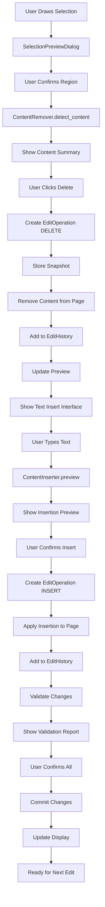

# Selection to Content Editing Workflow — Extended Implementation Plan

## Executive Summary

This document outlines the extension of the area selection system to support a complete interactive content modification workflow:
1. **Select** precise regions with visual feedback
2. **Delete** selected content while preserving document structure
3. **Insert** replacement text in same location maintaining context
4. **Validate** changes before confirming
5. **Maintain** undo/redo history
6. **Preserve** PDF formatting and quality

## Current State

The existing selection system provides:
- ✅ Multiple selection modes (rectangular, freehand)
- ✅ Coordinate adjustment interface
- ✅ Visual feedback and preview
- ✅ Precise region delimitation

## New Capabilities Required

### 1. Content Deletion

#### Design Requirements
- **Target Content**: Text and graphical elements within selected region
- **Preservation**: Document structure integrity maintained
- **Method**: Use PyMuPDF's annotation/removal capabilities
- **State**: Mark deleted regions without immediate permanence

#### Implementation Strategy
```
Detection Phase:
  - Identify all text blocks within selection rect
  - Identify all images within selection rect
  - Identify all graphical objects within selection
  
Removal Phase:
  - Create temporary overlay/mask
  - Store removed content for undo
  - Update page rendering
  
Cleanup Phase:
  - Adjust text reflow if needed
  - Preserve whitespace structure
  - Maintain page layout
```

### 2. Content Insertion

#### Design Requirements
- **Target Region**: Use selected area for positioning
- **Text Insertion**: Support multi-line text with formatting
- **Alignment**: Options for alignment within region
- **Formatting**: Font, size, color configuration
- **Flow**: Text wrapping within region bounds

#### Implementation Strategy
```
Preparation Phase:
  - Get selected region dimensions
  - Calculate available text area
  - Determine text properties
  
Insertion Phase:
  - Place text overlay at region start
  - Handle text wrapping
  - Respect region boundaries
  - Apply formatting
  
Validation Phase:
  - Verify text fits within region
  - Check for content overflow
  - Validate formatting preservation
```

### 3. Edit History & Undo/Redo

#### Data Structure
```python
class EditOperation:
    """Represents a single edit action"""
    operation_type: Enum  # DELETE, INSERT, MODIFY, BATCH
    page_index: int
    selection_region: SelectionRegion
    content_before: Dict  # Snapshot of content
    content_after: Dict   # New content
    timestamp: datetime
    description: str      # "Delete text in region", etc.
    
class EditHistory:
    """Manages undo/redo stack"""
    undo_stack: List[EditOperation]
    redo_stack: List[EditOperation]
    max_history: int = 50
    
    Methods:
    - push(operation)      # Add to history
    - undo()              # Revert last operation
    - redo()              # Reapply operation
    - clear()             # Reset history
    - export_summary()    # List of operations
```

### 4. Real-Time Feedback System

#### Feedback Types
```
Visual Feedback:
  - Selection highlighting
  - Deletion region preview (semi-transparent overlay)
  - Insertion preview with text rendering
  - Change indicators (color-coded)
  
Status Feedback:
  - Operation description ("Deleting text in region...")
  - Progress indication for batch operations
  - Memory usage for large documents
  
Validation Feedback:
  - Text overflow warnings
  - Formatting conflict alerts
  - Quality degradation warnings
```

### 5. Change Validation

#### Pre-Confirmation Checks
```
Content Validation:
  - Verify selected content can be removed
  - Check if text is extractable
  - Validate insertion text is valid
  - Check for overlapping edits
  
Format Validation:
  - Ensure text encoding compatibility
  - Check font availability
  - Validate color space compatibility
  - Verify page dimensions preserved
  
Structure Validation:
  - Page remains valid PDF
  - Document structure intact
  - Links/references unbroken
  - Form fields preserved
```

### 6. Quality Preservation

#### PDF Integrity
```
Techniques:
  - Use PyMuPDF's incremental updates
  - Preserve original page metadata
  - Maintain compression settings
  - Keep document info intact
  
Quality Metrics:
  - Text rendering quality (DPI preserved)
  - Color accuracy maintained
  - Font consistency verified
  - Layout proportions preserved
```

## Architecture Design

### New Modules Required

#### 1. `app/core/content_remover.py`
Handles content deletion from selected regions

```python
class ContentRemover:
    """Analyzes and removes content from PDF regions"""
    
    Methods:
    - detect_content_in_region(page, region) -> Dict
      Returns: text_blocks, images, graphics
    
    - remove_text_blocks(page, region, blocks) -> EditOperation
      Removes identified text blocks
    
    - remove_images(page, region, images) -> EditOperation
      Removes images within region
    
    - create_deletion_snapshot(page, region) -> bytes
      Saves deleted content for undo
    
    - validate_removable(page, region) -> Tuple[bool, List[str]]
      Returns validation status and warnings
```

#### 2. `app/core/content_inserter.py`
Handles text insertion into selected regions

```python
class ContentInserter:
    """Inserts text content into PDF regions"""
    
    Methods:
    - calculate_text_layout(text, region, font_size) -> TextLayout
      Returns word positions, line breaks, overflow info
    
    - insert_text(page, region, text, properties) -> EditOperation
      Inserts text with formatting
    
    - validate_insertion(region, text, properties) -> Tuple[bool, List[str]]
      Checks if text fits, format validity
    
    - preview_insertion(text, region) -> PIL.Image
      Generates preview of insertion
```

#### 3. `app/core/edit_history.py`
Manages undo/redo functionality

```python
class EditHistory:
    """Complete edit operation history"""
    
    Methods:
    - record_operation(operation: EditOperation) -> None
      Add operation to undo stack, clear redo
    
    - undo() -> EditOperation
      Revert to previous state
    
    - redo() -> EditOperation
      Reapply operation
    
    - can_undo() -> bool
    - can_redo() -> bool
    
    - get_history_summary() -> List[str]
      Human-readable operation list
    
    - clear_history() -> None
      Reset all history
```

### Enhanced Components

#### 1. Enhanced `SelectionManager` (`app/core/selection_manager.py`)
```python
# Add to existing SelectionManager
class SelectionManager:
    # NEW: Track operations on selection
    _pending_operation: Optional[EditOperation]
    
    Methods:
    - store_content_snapshot(region, page) -> bytes
      Saves current content at region
    
    - get_region_content_info(region, page) -> Dict
      Returns text/image/graphic counts
    
    - validate_region_editable(region, page) -> bool
      Checks if region can be modified
```

#### 2. Enhanced `SelectionPreviewDialog` (`app/ui/dialogs/selection_preview_dialog.py`)
```python
# Add tabs/sections for edit operations
class SelectionPreviewDialog:
    # Add new sections
    - "Delete Content" tab
    - "Insert Text" tab
    - "Preview Changes" tab
    
    NEW Widgets:
    - Delete confirmation checkbox
    - Text input field (multi-line)
    - Font/size/color selectors
    - Preview of changes
    - Validation warning display
```

#### 3. New Dialog: `EditOperationDialog` (`app/ui/dialogs/edit_operation_dialog.py`)
```python
class EditOperationDialog(CTkToplevel):
    """Advanced edit workflow dialog"""
    
    Sections:
    1. Current Content Preview
       - Shows what will be removed
       - Lists affected content types
       - Displays deletion preview
    
    2. Edit Operations
       - Step 1: Delete selected
       - Step 2: Insert replacement
       - Real-time preview
    
    3. Validation Panel
       - Warning list
       - Quality indicators
       - Confirmation checklist
    
    4. Action Buttons
       - Preview
       - Apply
       - Cancel
       - Help
```

#### 4. Enhanced MainWindow (`app/ui/main_window.py`)
```python
# Add new components
class MainWindow:
    # NEW instances
    _edit_history: EditHistory
    _content_remover: ContentRemover
    _content_inserter: ContentInserter
    
    # NEW toolbar buttons (after selection buttons)
    _btn_delete_selected: CTkButton  # 🗑 Delete Content
    _btn_insert_text: CTkButton      # ✏️ Insert Text
    _btn_undo: CTkButton             # ↶ Undo
    _btn_redo: CTkButton             # ↷ Redo
    
    # NEW action handlers
    - _action_delete_selected() -> None
    - _action_insert_text() -> None
    - _action_undo() -> None
    - _action_redo() -> None
    
    # NEW helpers
    - _show_edit_dialog(operation_type) -> None
    - _apply_edit_operation(op: EditOperation) -> None
    - _validate_operation(op: EditOperation) -> Tuple[bool, List[str]]
```

## Enhanced Workflow

### Step-by-Step Process

```
1. SELECT REGION
   ├─ User clicks "⬜ Rectangle" or "✏️ Freehand"
   ├─ User draws selection
   └─ Preview dialog shows adjustable region
      
2. ANALYZE CONTENT
   ├─ ContentRemover.detect_content_in_region()
   ├─ Display content summary (X text blocks, Y images)
   └─ Show warnings if needed

3. DELETE CONTENT
   ├─ User confirms deletion
   ├─ Create EditOperation(DELETE)
   ├─ Store snapshot of deleted content
   ├─ Remove content from page
   ├─ Preview shows "blank" region
   └─ Record in EditHistory

4. INSERT TEXT
   ├─ Open text entry interface
   ├─ User types replacement text
   ├─ Configure font/size/color
   ├─ ContentInserter.calculate_text_layout()
   ├─ Display insertion preview
   ├─ Check for overflow/warnings
   └─ User confirms insertion

5. CREATE OPERATION
   ├─ Create EditOperation(INSERT)
   ├─ Combine DELETE + INSERT operations
   ├─ Apply to page
   └─ Add to EditHistory

6. VALIDATE CHANGES
   ├─ Check PDF integrity
   ├─ Verify text formatting preserved
   ├─ Validate document structure
   ├─ Generate validation report
   └─ Show any warnings/errors

7. CONFIRM & SAVE
   ├─ User confirms all changes
   ├─ Mark operations as committed
   ├─ Disable undo for older operations (optional)
   ├─ Update page rendering
   └─ Ready for next edit or save

8. UNDO/REDO (ANY TIME)
   ├─ Click "↶ Undo" to revert last operation
   ├─ Click "↷ Redo" to reapply
   └─ History persists until document save
```

## UI Enhancement: Toolbar

### Current
```
[Open] [Save] | [Add Text] [⬜ Rect] [✏️ Free] [✖ Cancel] | [Up] [Down] [Delete]
```

### Enhanced
```
[Open] [Save] | [Add Text] [⬜ Rect] [✏️ Free] [✖ Cancel] | [🗑 Delete] [✏️ Insert] | [↶ Undo] [↷ Redo] | [Up] [Down] [Delete]
```

## Data Flow



## Implementation Phases

### Phase 1: Edit History Foundation
**Priority**: High
- Implement `EditHistory` class with undo/redo
- Add undo/redo buttons to toolbar
- Test with existing text addition feature

### Phase 2: Content Analysis & Removal
**Priority**: High
- Implement `ContentRemover` class
- Develop content detection (text, images)
- Create deletion preview interface
- Add deletion operation support

### Phase 3: Text Insertion
**Priority**: High
- Implement `ContentInserter` class
- Layout calculation engine
- Text insertion with formatting
- Insertion preview and validation

### Phase 4: Integrated Edit Dialog
**Priority**: Medium
- Create `EditOperationDialog`
- Combine delete + insert workflow
- Real-time preview system
- Validation feedback

### Phase 5: Quality & Validation
**Priority**: Medium
- PDF integrity validation
- Format preservation checks
- Quality metrics calculation
- Warning/error system

### Phase 6: Polish & Testing
**Priority**: Low
- Performance optimization
- Edge case handling
- User testing and feedback
- Documentation updates

## Technical Challenges & Solutions

### Challenge 1: Text Detection in Regions
**Problem**: Identifying which text belongs to a region
**Solution**: 
- Use PyMuPDF's text_dict() to get character positions
- Compare bounding boxes with selection region
- Handle multi-line text intelligently

### Challenge 2: Content Preservation During Deletion
**Problem**: Recovering deleted content for undo
**Solution**:
- Snapshot page content before modification
- Store in EditOperation
- Use full page snapshots for complete recovery

### Challenge 3: Text Reflow After Insertion
**Problem**: Maintaining proper text layout after changes
**Solution**:
- Use predefined text bounding box (selected region)
- Implement text wrapping algorithm
- Truncate if text exceeds region

### Challenge 4: Undo Memory Usage
**Problem**: Large page snapshots consume memory
**Solution**:
- Limit history size to 50 operations (configurable)
- Use incremental snapshots
- Clear history on document save

### Challenge 5: Format Preservation
**Problem**: Maintaining PDF formatting through edits
**Solution**:
- Use PyMuPDF's native text insertion
- Preserve original font metrics
- Maintain document structure

## Testing Strategy

### Unit Tests
```python
# test_content_remover.py
- test_detect_text_in_region()
- test_detect_images_in_region()
- test_removal_creates_valid_pdf()

# test_content_inserter.py
- test_text_layout_calculation()
- test_text_wrapping()
- test_font_compatibility()

# test_edit_history.py
- test_undo_redo()
- test_history_limit()
- test_operation_serialization()
```

### Integration Tests
```python
# test_edit_workflow.py
- test_select_delete_insert_cycle()
- test_undo_after_insert()
- test_multiple_edits_on_page()
- test_pdf_integrity_after_edits()
```

### UI Tests
```python
# test_edit_dialog_ui.py
- test_delete_preview()
- test_insert_preview()
- test_validation_display()
- test_undo_redo_buttons()
```

## Success Criteria

✅ **Functional**
- Users can delete selected content cleanly
- Users can insert text in deleted regions
- Undo/redo works correctly
- PDF remains valid after all operations

✅ **User Experience**
- Real-time feedback on all operations
- Clear validation warnings
- Intuitive workflow
- No unexpected behavior

✅ **Quality**
- PDF formatting preserved
- Text rendering unchanged
- Document structure maintained
- No document corruption

✅ **Performance**
- Operations complete in <1 second for typical pages
- Undo/redo instant
- Memory usage reasonable (<100MB for history)

## Deliverables

1. **Core Modules**
   - `content_remover.py`
   - `content_inserter.py`
   - `edit_history.py`

2. **UI Components**
   - `EditOperationDialog`
   - Toolbar button additions
   - Status/feedback system

3. **Enhanced Classes**
   - SelectionManager (extended)
   - SelectionPreviewDialog (extended)
   - MainWindow (extended)

4. **Documentation**
   - User guide for edit workflow
   - Technical design document
   - API reference
   - Troubleshooting guide

## Timeline Estimate

- **Phase 1 (Edit History)**: 2-3 days
- **Phase 2 (Content Removal)**: 3-4 days
- **Phase 3 (Text Insertion)**: 3-4 days
- **Phase 4 (Dialog Integration)**: 2-3 days
- **Phase 5 (Validation)**: 2-3 days
- **Phase 6 (Polish & Testing)**: 3-4 days

**Total**: 15-21 days for complete implementation

## Conclusion

This extended workflow transforms the selection system from a precision region identifier into a complete content editing engine. By combining selection, deletion, insertion, and validation, users gain powerful capabilities to modify PDF content while maintaining document integrity and quality.
