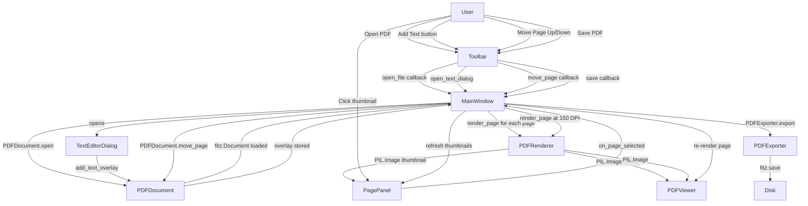

# PDF Editor — Desktop Application Architecture (Phase 1 MVP)

## 1. Technology Stack

| Layer | Technology | Purpose |
|-------|-----------|---------|
| GUI Framework | CustomTkinter | Modern UI widgets on top of Tkinter |
| PDF Engine | PyMuPDF (fitz) | Open, render, edit and save PDF files |
| Image Processing | Pillow (PIL) | Convert rendered PDF pages to CTkImage |
| Language | Python 3.11+ | Core application language |

---

## 2. Project Structure

```
PDF Editor/
├── main.py                          # Entry point — launches the app
├── requirements.txt                 # Python dependencies
├── plans/
│   └── architecture.md              # This document
├── assets/
│   └── icons/                       # UI icons (optional)
└── app/
    ├── __init__.py
    ├── app.py                       # App bootstrap and lifecycle
    ├── core/
    │   ├── __init__.py
    │   ├── pdf_document.py          # PDF model — owns the fitz.Document
    │   ├── pdf_renderer.py          # Renders PDF pages to PIL images
    │   └── pdf_exporter.py          # Saves/exports the modified PDF
    └── ui/
        ├── __init__.py
        ├── main_window.py           # Root CTk window and layout grid
        ├── toolbar.py               # Top toolbar (Open, Save, Add Text, etc.)
        ├── pdf_viewer.py            # Scrollable canvas showing the active page
        ├── page_panel.py            # Left sidebar with page thumbnails
        └── dialogs/
            ├── __init__.py
            └── text_editor_dialog.py  # Modal dialog to add/edit text on a page
```

---

## 3. Component Responsibilities

### `app/core/pdf_document.py` — `PDFDocument`
- Wraps a `fitz.Document` instance.
- Maintains the **list of pages** (used for reordering).
- Tracks **text overlays** added by the user (list of dicts: `{page, x, y, text, font_size, color}`).
- Provides methods: `open(path)`, `close()`, `move_page(from_idx, to_idx)`, `delete_page(idx)`, `add_text_overlay(...)`, `page_count`, `get_page(idx)`.

### `app/core/pdf_renderer.py` — `PDFRenderer`
- Stateless helper that accepts a `fitz.Page` and renders it to a `PIL.Image`.
- Configurable DPI (default 150 for viewer, 72 for thumbnails).
- Method: `render_page(page, dpi) -> PIL.Image`.

### `app/core/pdf_exporter.py` — `PDFExporter`
- Applies pending text overlays onto the pages using `fitz` annotations.
- Saves to a new file path via `fitz.Document.save()`.
- Method: `export(document: PDFDocument, output_path: str)`.

### `app/ui/main_window.py` — `MainWindow`
- Root `customtkinter.CTk` window.
- Layout: **3-column grid** — `PagePanel` (left, fixed width) | `PDFViewer` (center, expandable) | future properties panel (right, hidden in MVP).
- Holds references to `PDFDocument`, `PDFRenderer`, and all UI components.
- Acts as the **mediator** — routes events from toolbar/panel to core and back.

### `app/ui/toolbar.py` — `Toolbar`
- `CTkFrame` at the top of the window.
- Buttons: **Open PDF**, **Save PDF**, **Add Text**, **Move Page Up**, **Move Page Down**, **Delete Page**.
- Emits callbacks injected by `MainWindow`.

### `app/ui/pdf_viewer.py` — `PDFViewer`
- `CTkScrollableFrame` or `Canvas` widget displaying the **current page** at full resolution.
- Receives a `PIL.Image` and displays it via `CTkImage`.
- Supports basic zoom (Ctrl+scroll wheel).

### `app/ui/page_panel.py` — `PagePanel`
- Left sidebar listing all pages as small thumbnail images.
- Each thumbnail is a `CTkButton` with the rendered thumbnail.
- Clicking a thumbnail fires `on_page_selected(idx)` → `MainWindow` updates `PDFViewer`.
- Thumbnails are regenerated after page reorder/delete.

### `app/ui/dialogs/text_editor_dialog.py` — `TextEditorDialog`
- `CTkToplevel` modal dialog.
- Fields: text content, font size, color picker (basic), X/Y position.
- On confirm → calls `PDFDocument.add_text_overlay(...)` and refreshes viewer.

---

## 4. Data Flow



---

## 5. Dependencies (`requirements.txt`)

```
customtkinter>=5.2.0
PyMuPDF>=1.24.0
Pillow>=10.0.0
```

---

## 6. Key Design Decisions

| Decision | Choice | Rationale |
|----------|--------|-----------|
| PDF Engine | PyMuPDF (fitz) | Best Python PDF library — handles rendering, text insertion, and saving in one package |
| Overlay approach | In-memory overlay list, applied on export | Non-destructive editing; user can undo before saving |
| GUI layout | 3-column grid (sidebar + viewer + future panel) | Extensible for Phase 2 features without restructuring |
| Image rendering | PIL → CTkImage | Required by CustomTkinter for proper HiDPI support |
| Thumbnail DPI | 72 DPI | Fast enough for sidebar previews without memory overhead |

---

## 7. Phase 2 Extension Points (future)

- `app/core/ocr_processor.py` — Tesseract/pytesseract integration.
- `app/core/signature_manager.py` — Signature drawing canvas.
- `app/ui/annotation_toolbar.py` — Highlight, comment, free-draw tools.
- `app/ui/dialogs/signature_dialog.py` — Signature creation modal.
